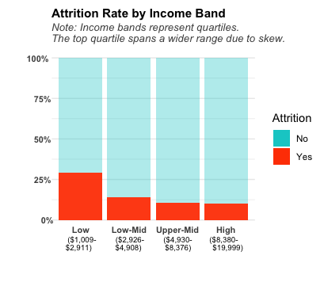

# employee-attrition
Analysis of employee attrition using R
# Employee Attrition Analysis (R)

## Overview
Though attrition is a natural part of the employee lifecycle, uneven or elevated turnover can disrupt team stability and organizational performance. This project explores employee attrition patterns using an HR dataset by focusing on factors such as age, income, and workload. The analysis emphasizes exploratory data analysis and visual storytelling using R to reveal meaningul workforce insights.

## Key Questions
- How does attrition vary by age group?
- Are certain job roles associated with higher attrition rates?
- Is overtime associated with increased attrition?
- How does income relate to attrition across career stages?

## Key Findings
- Attrition is highest among early-career employees and steadily declines with age.
- Overtime amplifies attrition risk, particularly amongst younger age groups.
- Income appears to impact attrition risk early in careers and declines in influence with age.
- Sales Representatives exhibit higher attrition rate(~40%), compared to all other roles (<24%), suggesting role-specific factors may contribute to higher turnover.

## Visual Highlights
### Attrition Rate by Age Group
Attrition is highest among early-career employees and declines steadily across older age groups.

### Attrition Rate by Job Role
Sales Representatives exhibit a notably higher attrition rate (~40%) compared to other roles, suggesting role-specific retention challenges.

### Attrition Rate by Income Band
Employees in the lowest income band experience attrition rates more than double those of higher-income bands.

### Attrition Rate by Age Group & Overtime
Overtime amplifies attrition risk, particularly amongst younger age groups.

## Data
- **Source:** Employee Attrition dataset (Kaggle)
- **Records:** ~1,470 employees
- **Key Variables:** age, monthly income, job role, overtime, and attrition status.

## Tools Used
- R
- RStudio
- tidyverse
- ggplot2

## Methods
- Data cleaning and validation
- Feature engineering (age groups, income bands)
- Exploratory data analysis
- Proportional comparisons and visualization

## Visualizations
The analysis includes:
- Employee count by age group
- Attrition rate by age group
- Attrition rate by job role
- Attrition rate by overtime status across age groups
- Attrition rate by income band
- Monthly income distribution by age group with attrition overlay

## Notes
This analysis is observational and does not imply causation. Some subgroups contain small sample sizes and are interpreted cautiously.

## Data Source
This project uses the Employee Attrition dataset obtained from Kaggle.

- **Source:** Kaggle
- **License:** Creative Commons Attribution–NonCommercial–NoDerivatives 4.0 (CC BY-NC-ND 4.0)

The dataset is not included in this repository in accordance with the license terms.
